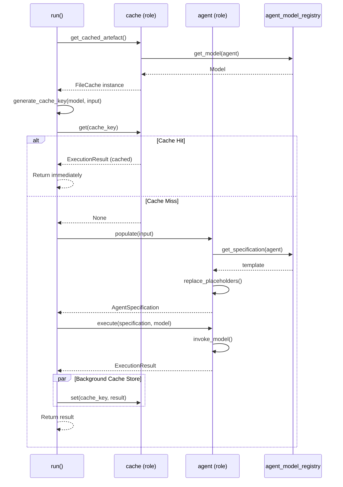
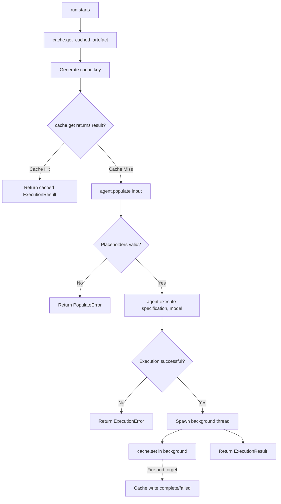

# Agent Runner Context

## Overview
The Agent Runner context manages the execution of agents by providing templating, model resolution, caching, and execution orchestration. It handles placeholder replacement in system prompts, validates required inputs, coordinates the agent execution lifecycle, and provides persistent caching for agent results.

## Role Players
Objects passed to the constructor that receive role methods:

### agent
**Type**: `String`

**Description**: The agent name used to identify and load the agent specification from the agent registry. This name is used as a key for registry lookups and cache key generation.

---

### cache
**Type**: No object plays this role

**Description**: This is a virtual role player with no backing object. Role methods on this role are used to obtain cache instances dynamically.

---

## Props
Values passed to the constructor:

- **input**: `T` (generically typed) - The input data containing values to populate template placeholders
- **agent_registry**: `AgentRegistry` - A registry used to load agent specifications by agent name
- **agent_model_registry**: `AgentModelRegistry` - A registry used to resolve the execution model for a given agent name

---

## Role Methods
Private methods that operate on the role players using the context's props:

### agent.populate
**Signature**: `fn populate(this: String, input: T) -> Result<AgentSpecification, PopulateError>`

**Description**: Runs the templating engine using the agent specifications from the agent registry with values from the input prop. Replaces all placeholders in the system prompt and validates requirements.

**Uses from context**:
- `input` prop - The data source for template placeholder values
- `agent_registry` prop - To retrieve the agent specification template using the agent name

**Parameters**:
- `this`: The agent name (role player) used to load the specification
- `input`: The generic input data

**Template Placeholder Syntax**:
- **Mandatory placeholders**: `{{input.prop_name}}` - Must be replaced with a valid value (not None)
- **Optional placeholders**: `{{input.prop_name?}}` - Can be replaced with None if no value provided
- **Nested paths**: `{{input.prop1.prop_of_prop1}}` - Supports multiple levels of nesting
- **Whitespace handling**: Spaces within braces are ignored: `{{ input.prop }}` == `{{input.prop}}`

**Returns**: An `AgentSpecification` with all placeholders replaced, or an error if:
- Any mandatory placeholder cannot be replaced with a valid value
- A referenced path does not exist in the input
- The placeholder path is invalid (doesn't start with "input")

**Invariants Enforced**:
- All mandatory placeholders must be replaced with non-None values
- All placeholders must reference valid paths in the input structure
- The resulting specification must be valid and ready for execution

**Privacy**: This role method is private to the Agent Runner context

---

### agent.execute
**Signature**: `fn execute(this: String, specification: AgentSpecification, model: Model) -> Result<ExecutionResult, ExecutionError>`

**Description**: Executes the agent using the populated specification and the resolved model from the agent model registry. The actual invocation can happen in Rust if appropriate tooling exists, or via a Python runner using stdio. If the agent supports conversational style, the conversation should be treated as part of the template.

**Uses from context**:
- `agent_model_registry` prop - To resolve the appropriate model for execution
- The result from `populate()` - The instantiated agent specification

**Parameters**:
- `this`: The agent name (role player)
- `specification`: The populated AgentSpecification (from populate())
- `model`: The resolved execution model (from agent_model_registry)

**Process**:
1. Use the agent model registry to find the appropriate model for the agent (using the agent name)
2. Apply the populated specification to the agent
3. Execute the agent with the resolved model:
   - If Rust tooling is available, execute directly in Rust
   - Otherwise, use a Python runner via stdio for model invocation
4. If the agent supports conversational style:
   - Treat multi-turn conversation as part of the template expansion
   - Maintain conversational context between exchanges
   - Continue until final result is obtained
5. Return the execution result

**Execution Modes**:
- **Rust Native**: Direct execution using Rust-based model invocation
- **Python via stdio**: Execute by communicating with a Python process over standard I/O
- **Conversational**: Multi-turn interaction with the model as part of template processing

**Returns**:
- `Ok(ExecutionResult)` - The result of the agent execution
- `Err(ExecutionError)` - If execution fails

**Invariants Enforced**:
- The specification must be fully populated before execution
- The model must be valid and available
- Execution state must be properly managed
- Communication with Python runner (if used) must be reliable
- Conversational context must be maintained if applicable

**Privacy**: This role method is private to the Agent Runner context

---

### cache.get_cached_artefact
**Signature**: `fn get_cached_artefact() -> impl Cache`

**Description**: Creates and returns a FileCache instance configured for this agent and model. The FileCache implements the Cache trait.

**Uses from context**:
- `agent` role player - The agent name used for cache folder structure
- `agent_model_registry` prop - To resolve the model name for cache folder structure

**Parameters**: None (uses context props)

**Returns**: An object implementing the Cache trait (specifically a FileCache)

**Process**:
1. Get the agent name from the `agent` role player
2. Resolve the model name using the `agent_model_registry`
3. Create a FileCache with:
   - `folder`: Defaults to `.cache`
   - `agent_name`: From the agent role player
   - `model_name`: From the resolved model
4. Return the FileCache instance

**Usage**: This method is called by the `run()` function to obtain a cache instance for storing/retrieving execution results.

**Privacy**: This role method is private to the Agent Runner context

---

## Functionality
Public functions available on the Agent Runner context:

### run
**Signature**: `fn run(self) -> Result<ExecutionResult, AgentRunnerError>`

**Description**: Activates the agent by orchestrating the complete execution lifecycle with persistent caching. This is the main entry point for agent execution.

**Uses from context**:
- `agent` role player (agent name)
- `input` prop
- `agent_registry` prop
- `agent_model_registry` prop
- `cache` role player (via `get_cached_artefact()` method)

**Cache Key Composition**:
The cache key is based on:
- Agent name (from the agent role player)
- Model name (resolved from agent_model_registry)
- Template values (the actual values used for placeholder replacement from input)

**Process**:
1. Call `cache.get_cached_artefact()` to obtain a cache instance
2. Resolve model using `agent_model_registry.get_model(agent)` to generate cache key
3. Generate cache key based on agent_name, model_name, and serialized input
4. Check cache for existing result using `cache.get(key)`:
   - **Cache hit**: Return cached result immediately
   - **Cache miss**: Continue to steps 5-8
5. Call `agent.populate(input)` to instantiate the agent specification with input values
6. Call `agent.execute(specification, model)` to run the agent
7. Store result in cache using `cache.set(key, result)` (background operation) and return result
8. Return the execution result

**Caching Behavior**:
- Cache lookup is synchronous and fast
- Cache storage happens in the background (non-blocking)
- Cache storage failures do not prevent result from being returned
- Even if cache write fails, the execution result is still returned successfully

**Business Rules**:
All business rules and invariants are enforced by the role methods:
- `populate()` enforces: all mandatory placeholders replaced, valid paths, proper values
- `execute()` enforces: valid specification, model availability, execution state management

**Returns**:
- `Ok(ExecutionResult)` - The result of the successful agent execution (from cache or fresh execution)
- `Err(AgentRunnerError)` - Specific error if any invariant is violated or execution fails

**Side Effects**:
- Consumes self (immutable pattern)
- Reads from cache (synchronous)
- Writes to cache in background (asynchronous, non-blocking, failure-tolerant)
- May perform I/O operations during model resolution and agent execution

### run() - Interaction Diagram

This sequence diagram shows how the `run()` functionality orchestrates interactions between the role players and their methods:

This diagram illustrates:
- How `run()` first obtains a cache instance via `cache.get_cached_artefact()`
- The cache hit path (fast return) vs cache miss path (full execution)
- How `agent.populate()` processes templates using the registry
- How `agent.execute()` runs the actual model invocation
- Background cache storage that doesn't block the result

### run() - Decision Flow

This flowchart shows the decision logic and execution paths within the `run()` functionality:

This diagram shows:
- The fast path for cache hits (no execution needed)
- Validation points where errors can occur
- The background cache write that doesn't block the result
- Clear separation between cache hit and cache miss paths

---

## Error Types

The context defines these error codes and messages:

| Error Code | Condition | Message |
|------------|-----------|---------|
| `MISSING_MANDATORY_PLACEHOLDER` | Mandatory placeholder has no value | "Required placeholder '{{placeholder}}' could not be resolved" |
| `INVALID_PLACEHOLDER_PATH` | Placeholder path does not exist in input | "Invalid path '{{path}}' in placeholder" |
| `AGENT_NOT_FOUND` | Agent specification not found in registry | "Agent '{{agent_name}}' not found in registry" |
| `MODEL_NOT_FOUND` | Model not found in model registry | "Model for agent '{{agent_name}}' not found" |
| `EXECUTION_FAILED` | Agent execution encountered an error | "Agent execution failed: {{details}}" |
| `INVALID_SPECIFICATION` | Populated specification is invalid | "Agent specification is invalid: {{details}}" |
| `PYTHON_RUNNER_ERROR` | Python runner communication failed | "Failed to communicate with Python runner: {{details}}" |

---

## Invariants

1. **Complete Population**: All mandatory placeholders must be replaced before execution
2. **Valid Input Structure**: Input must contain all referenced paths for mandatory placeholders
3. **Model Availability**: The required execution model must be available in the model registry
4. **Specification Validity**: The populated specification must be valid and executable
5. **Single Execution**: Each agent runner executes exactly once (consumes self)
6. **Immutability**: The context consumes itself and returns an execution result
7. **Cache Resilience**: Cache failures (read or write) do not prevent execution or result return
8. **Deterministic Cache Keys**: Same agent name + model + input values always generate the same cache key

## Template Processing Rules

1. **Whitespace Handling**: Spaces within placeholder braces are ignored: `{{ input.prop }}` == `{{input.prop}}`
2. **Path Resolution**: Nested paths are resolved depth-first: `{{input.a.b.c}}` resolves `input.a`, then `a.b`, then `b.c`
3. **Optional Marker**: The `?` suffix must be at the end of the placeholder: `{{input.prop?}}`
4. **Error on Missing**: Missing mandatory values fail immediately during populate, not during execution
5. **None Handling**: Optional placeholders with None values are replaced with empty string

## Caching Architecture

### Cache Key Generation
The cache key is generated based on three components:
1. **Agent name**: The string identifier for the agent
2. **Model name**: The resolved model identifier from the agent model registry
3. **Template values**: The actual values extracted from input that are used for placeholder replacement

The key is generated by:
- Creating a composite string: `{agent}:{model}:{json_serialized_input}`
- Hashing with SHA256 to get a fixed-size, stable key
- Hex-encoding the hash for filesystem compatibility

### Cache Behavior
- **Cache hits** return immediately without executing the agent
- **Cache misses** trigger full agent execution
- **Background storage**: Results are stored asynchronously after being returned
- **Failure tolerance**: Cache write failures are logged but do not affect result delivery
- **Persistent**: Cache persists across multiple runs of the agent runner

### Performance Implications
- First execution for a given key: Full execution time + background cache write
- Subsequent executions with same key: Cache lookup time only (significantly faster)
- Cache writes never block the result from being returned to the caller

## Notes

- This context coordinates between multiple registries for loose coupling
- The templating engine is built into the agent runner for convenience
- Agent execution is lazy - population happens just before execution (unless cached)
- The agent runner is single-use and stateless between runs
- Errors are detailed to aid debugging of template and execution issues
- The cache makes the agent runner suitable for repeated executions with identical inputs
- Python runner via stdio provides flexibility when Rust tooling is unavailable
