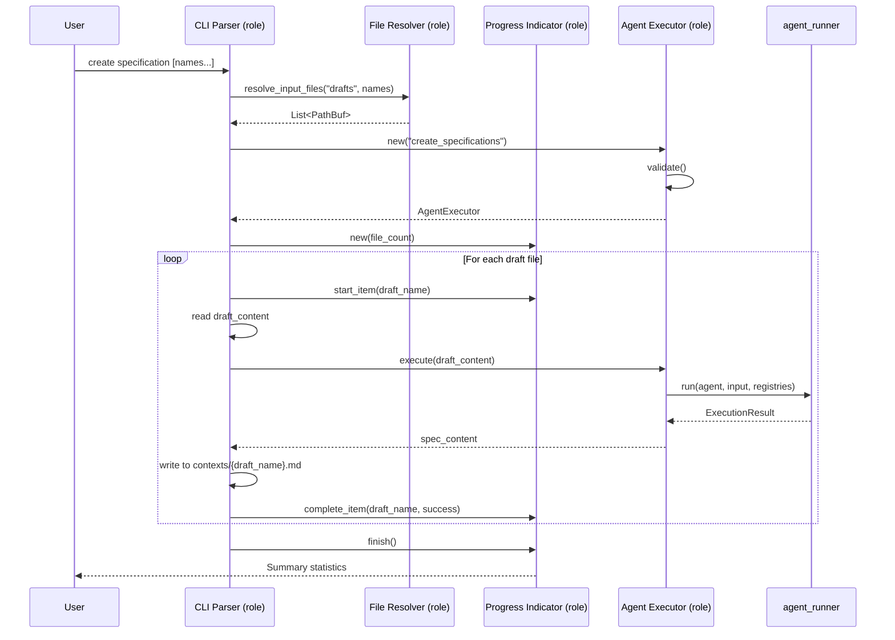
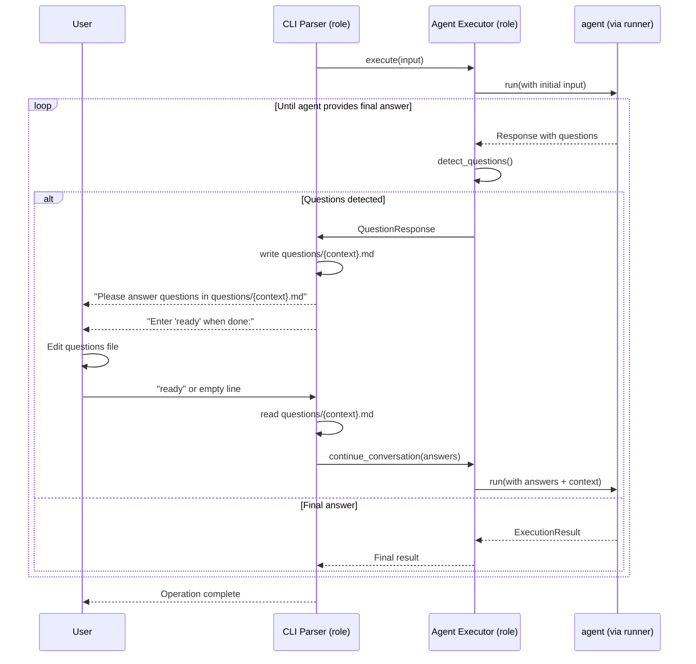

# App

## System Prompt

You are tasked with implementing the main application for the reen tool. This is a CLI that functions as a compiler-like system for agent-driven specification and implementation.

The application should:
- Use Rust with the clap crate for CLI argument parsing
- Implement three main commands: create (with subcommands), compile, and test
- Support global flags: --verbose and --dry-run
- Follow idiomatic Rust naming conventions
- Integrate with the agent_runner context for executing agents

## Input Format

The input is the draft specification from drafts/app.md.

## Output Format

Generate the following Rust source files:
- src/main.rs - Main entry point with CLI structure
- src/cli/mod.rs - CLI command implementations
- src/cli/agent_executor.rs - Agent execution wrapper
- src/cli/progress.rs - Progress indication for multi-file processing

Update Cargo.toml with necessary dependencies:
- clap (with derive feature)
- anyhow for error handling
- tokio for async runtime
- yaml-rust for parsing YAML configs

## Props

- **drafts_dir**: Directory containing draft files (default: "drafts")
- **contexts_dir**: Directory containing context specifications (default: "contexts")
- **agents_dir**: Directory containing agent specifications (default: "agents")
- **src_dir**: Directory for generated source code (default: "src")

## Roles

- **CLI Parser**: Parses command-line arguments and dispatches to appropriate handlers
- **Agent Executor**: Executes agents through the agent_runner
- **Progress Indicator**: Shows progress during multi-file operations
- **File Resolver**: Resolves input files based on provided names or directory contents

## Role Methods

### CLI Parser
- **parse**: Parses command-line arguments into structured commands
- **dispatch**: Routes commands to appropriate handlers

### Agent Executor
- **new**: Creates executor for a specific agent
- **execute**: Runs the agent with provided input
- **validate**: Checks that agent specification exists

### Progress Indicator
- **new**: Creates indicator for tracking N items
- **start_item**: Marks start of processing an item
- **complete_item**: Marks completion (success/failure) of an item
- **finish**: Displays summary statistics

### File Resolver
- **resolve_input_files**: Gets list of files to process based on names or all files in directory

## Description

This is the main application. It's a CLI that functions as a compiler. Based on drafts for individual use cases and functional areas, the system will be able to create specifications. The specifications can then be reviewed and subsequently implemented and compiled.

## Functionality

### Create Specification Command
- Reads draft files from the drafts/ directory
- For each draft, executes the "create_specifications" agent
- Outputs generated specifications to contexts/ directory
- Overwrites existing specifications with the same name
- Continues processing remaining files if one fails
- Shows progress indication for multiple files

#### Create Specification - Interaction Diagram

This sequence diagram shows how the create specification command orchestrates role interactions:

This diagram illustrates:
- Command routing from user input to CLI Parser
- File resolution using the File Resolver role
- Progress tracking with the Progress Indicator role
- Agent execution via the Agent Executor role
- Integration with agent_runner for actual model invocation
- File I/O operations (read drafts, write contexts)

### Create Implementation Command
- Reads context files from the contexts/ directory
- For each context, executes the "create_implementation" agent
- Agent determines output structure (may create files in src/, src/contexts/, src/types/, etc.)
- Language choice defaults to Rust but agent can override
- Continues processing remaining files if one fails
- Shows progress indication for multiple files

### Create Tests Command
- Reads context files from the contexts/ directory
- For each context, executes the "create_test" agent
- Generates idiomatic Rust tests
- Continues processing remaining files if one fails
- Shows progress indication for multiple files

### Compile Command
- Wrapper around `cargo build`
- Shows output in verbose mode or on failure
- Returns appropriate exit code

### Test Command
- Wrapper around `cargo test`
- Shows output in verbose mode or on failure
- Returns appropriate exit code

### Global Options
- **--verbose**: Enable debug output showing detailed execution information
- **--dry-run**: Show what would be done without executing actions

### Validation
- Gracefully fails if required files don't exist (e.g., drafts/, contexts/ directories)
- Validates that agent specifications exist before execution
- Returns clear error messages for missing configurations

### Question Handling
Agents are instructed not to assume anything but to ask questions. When an agent needs clarification:
1. The agent generates a markdown file with required context and questions
2. The CLI notifies the user to update the file
3. The user updates the file and signals readiness by entering "ready" or an empty line
4. The CLI sends the answers back to the agent as part of the conversation
5. Conversational context is maintained throughout the session

#### Question Handling - Interaction Diagram

This sequence diagram shows how the CLI handles conversational interactions with agents:

This diagram shows:
- Initial agent execution with user input
- Question detection in agent responses
- Question file generation in questions/ directory
- User interaction loop (edit file, signal ready)
- Conversation continuation with updated answers
- Context preservation across multiple agent invocations
- Final result delivery when agent completes
