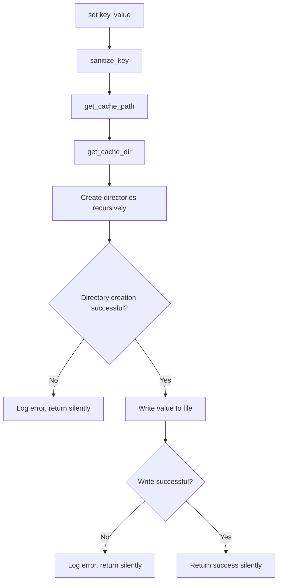
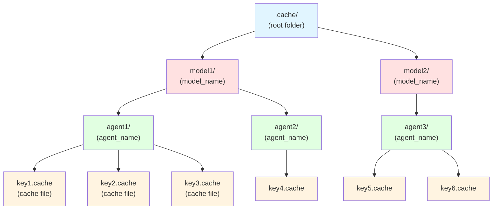

# FileCache Context

## Overview
The FileCache context is an implementation of the Cache trait that persists cache artifacts in a file structure. It organizes cached data hierarchically using agent name and model name as folder structures, with individual cache entries stored as files.

## Role Players
None - This context has no role players. All functionality is self-contained within the FileCache instance.

## Props
Values passed to the constructor:

- **folder**: `Option<String>` - The root folder path for the cache. Defaults to `.cache` if not specified
- **agent_name**: `String` - Name of the agent that the cache is for, used as a subfolder
- **model_name**: `String` - Name of the model the cache is for, used as a subfolder

---

## Functionality
Public functions available on the FileCache context (implementing the Cache trait):

### get
**Signature**: `fn get(&self, key: &str) -> Option<String>`

**Description**: Retrieves a cached value for the given key.

**Uses from context**:
- `folder` prop - The root cache directory
- `agent_name` prop - Used in the path construction
- `model_name` prop - Used in the path construction

**File Path Construction**:
```
{folder}/{model_name}/{agent_name}/{safe_key}.cache
```

Where:
- `{folder}` is the root cache folder (defaults to `.cache`)
- `{model_name}` is the model name subfolder (first level)
- `{agent_name}` is the agent name subfolder (second level)
- `{safe_key}` is the key made safe for use as a filename
- `.cache` is the file extension

**Key Sanitization**:
The key is made safe for use as a filename by:
- Replacing characters that are invalid in filenames
- Ensuring the resulting filename is valid across operating systems
- Replaced characters: `/`, `\`, `:`, `*`, `?`, `"`, `<`, `>`, `|` → `_`

**Returns**:
- `Some(String)` - The cached value if found and readable
- `None` - If the cache file doesn't exist or cannot be read

**Error Handling**:
- File not found: Returns `None` (cache miss)
- Read errors: Returns `None` (treat as cache miss)
- Does not panic on filesystem errors

### get() - Interaction Diagram

This flowchart shows how the `get()` method retrieves cached values:

```mermaid
flowchart TD
    A[get key] --> B[sanitize_key]
    B --> C[get_cache_path]
    C --> D[Construct path:<br/>{folder}/{model_name}/{agent_name}/{safe_key}.cache]

    D --> E{File exists?}
    E -->|No| F[Return None<br/>cache miss]
    E -->|Yes| G[Read file contents]

    G --> H{Read successful?}
    H -->|No| I[Return None<br/>treat as cache miss]
    H -->|Yes| J[Return Some String<br/>cache hit]
```

This diagram shows:
- Key sanitization for filesystem safety
- Path construction using props
- File existence and readability checks
- Graceful handling of errors (no panics)

---

### set
**Signature**: `fn set(&self, key: &str, value: &str)`

**Description**: Stores a value in the cache for the given key. Creates necessary directories if they don't exist.

**Uses from context**:
- `folder` prop - The root cache directory
- `agent_name` prop - Used in the path construction
- `model_name` prop - Used in the path construction

**File Path Construction**:
Same as `get()`:
```
{folder}/{model_name}/{agent_name}/{safe_key}.cache
```

**Process**:
1. Sanitize the key to create a safe filename
2. Construct the full directory path: `{folder}/{model_name}/{agent_name}/`
3. Create all necessary directories if they don't exist (recursive directory creation)
4. Write the value to the file: `{safe_key}.cache`
5. Handle any errors gracefully without panicking

**Directory Creation**:
- Creates parent directories recursively if they don't exist
- If directory creation fails, the operation fails silently

**File Writing**:
- Overwrites existing cache files with the same key
- Ensures file is fully written before returning
- Uses standard filesystem write operations

**Error Handling**:
- Directory creation errors: Operation fails silently
- Write errors: Operation fails silently
- Does not panic on filesystem errors
- Errors may be logged but don't propagate to caller

**Side Effects**:
- Creates directories on the filesystem
- Creates or overwrites cache files
- May perform I/O operations

### set() - Interaction Diagram

This flowchart shows how the `set()` method stores values in the cache:



This diagram shows:
- Key sanitization before use
- Directory creation with error handling
- File write operation
- Silent failure mode (no panics, no errors propagated)

---

### File Organization Diagram

This diagram shows the hierarchical structure of cached files:



This diagram illustrates:
- Root cache directory (configurable via `folder` prop)
- Model-level organization (first subfolder level)
- Agent-level organization (second subfolder level)
- Individual cache files with `.cache` extension
- Clear namespace separation

---

## Cache Trait Implementation

This context implements the `Cache` trait:

```rust
trait Cache {
    fn get(&self, key: &str) -> Option<String>;
    fn set(&self, key: &str, value: &str);
}
```

All trait contract requirements are met:
- `get()` returns `Option<String>` for safe cache lookups
- `set()` stores values without returning errors
- Both methods handle errors gracefully internally

---

## Key Sanitization Rules

To ensure cross-platform compatibility, keys are sanitized before use as filenames:

1. **Reserved Characters**: Replace characters that are invalid in filenames: `/ \ : * ? " < > |`
2. **Replacement Strategy**: Replace all invalid characters with underscores `_`
3. **Length Limits**: Keys should respect filesystem filename length limits (typically 255 characters)
4. **Case Sensitivity**: Be aware of case-insensitive filesystems (Windows, macOS by default)
5. **Preservation**: Valid characters are preserved as-is (alphanumeric, hyphens, dots, etc.)

---

## Invariants

1. **Directory Hierarchy**: Cache files are always stored under `{folder}/{model_name}/{agent_name}/`
2. **File Extension**: All cache files use the `.cache` extension
3. **Key Uniqueness**: Each unique key maps to exactly one cache file within an agent/model namespace
4. **Error Resilience**: Filesystem errors never panic, only result in cache miss or silent write failure
5. **Idempotent Writes**: Writing the same key/value multiple times produces the same result
6. **Immutable Props**: The folder, agent_name, and model_name are set at construction and never change
7. **Namespace Isolation**: Different agent/model combinations never interfere with each other's cache

---

## Performance Considerations

- **Read Performance**: Direct file reads, fast for local filesystems
- **Write Performance**: May be slower due to directory creation and file I/O
- **Concurrent Access**: No built-in locking; suitable for single-process use or external coordination
- **Storage Efficiency**: Each cache entry is a separate file; overhead for small values
- **Cleanup**: No automatic expiration; old cache files persist until manually deleted
- **Scalability**: Performance degrades with very large numbers of cache files in a single directory

---

## Benefits of This Structure

- **Namespace separation**: Different agents and models don't interfere
- **Easy inspection**: Cache can be browsed in a file explorer
- **Selective clearing**: Can clear cache for specific agent/model combinations by deleting directories
- **Portable**: Works across different operating systems
- **Simple**: No database or complex serialization needed
- **Debuggable**: File contents can be inspected directly
- **Version-friendly**: Can maintain multiple model versions side-by-side

---

## Notes

- This implementation prioritizes simplicity over performance
- Suitable for development and small-scale deployments
- Not optimized for high-concurrency scenarios
- No built-in cache expiration or size limits
- Consider adding cleanup utilities for production use
- The file structure makes debugging and manual inspection easy
- All I/O errors are handled gracefully without propagating to callers
- The cache is fail-safe: failures to write never affect normal operation
