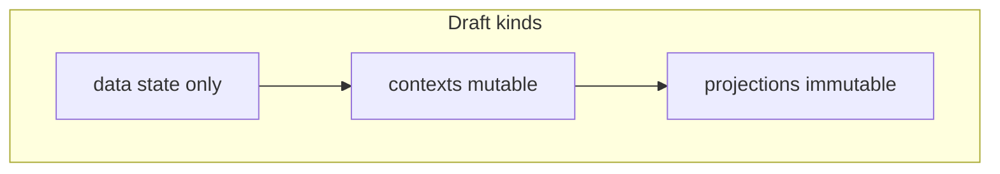

# Agent Types for Specification Creation

The reen system uses **four** specification agents based on the type of draft being processed (data, context, projection, and root application). This ensures that specifications are tailored to the nature of each component type.

For the conceptual distinction between these kinds, see **[Data, Context, and Projection](#data-context-and-projection-reen)** below.

## Data, Context, and Projection (reen)

These are **reen conventions**, not snake-specific: they are expressed by folder layout under `drafts/`, by agent selection, and by implementation prompts.

| Kind | Folder | What it is |
|------|--------|------------|
| **Data** | `drafts/data/` | **State only**—fields and variants at a point in time, like values in memory. No domain behavior: no steering, scoring rules, collision logic, time-based game rules, or other orchestration *on the data type itself*. Validation that encodes business rules and state transitions belong in **contexts**, not on data types. |
| **Context** | `drafts/contexts/` | **Mutable orchestration**—role players, props, **role methods**, lifecycle, and the rules that change or coordinate state. This is where “accelerate” lives relative to a velocity *value*: not on the integer, but on the object that applies physics. |
| **Projection** | `drafts/projections/` | **Like a context, but immutable**—same authoring shape (props, role players, role methods, functionalities) and read-side behavior, but the instance does not mutate after construction (CQRS-style read model). No `&mut self`; pure outputs over fixed inputs. Not a substitute for `drafts/data` value types. |

**Root application** (`drafts/app.md`) is handled separately (see below); it wires collaborators and lifecycle without replacing data or context specs.



For artifact-structure notes and parser-facing draft kinds, see [`plans/DRAFT_ARTIFACT_STRUCTURE_FOR_REEN.md`](../plans/DRAFT_ARTIFACT_STRUCTURE_FOR_REEN.md).

## Agent Selection

The system automatically selects the appropriate agent based on the file's location in the `drafts/` folder:

### 1. Data Type Agent (`create_specifications_data`)

**Used for**: `drafts/data/*.md`

**Purpose**: Creates specifications for simple data types: **state shape and invariants**, not domain behavior or role players.

**Characteristics**:
- Simple structs or enums with fields/variants
- **IMMUTABLE by default** — all fields are read-only unless explicitly documented as mutable
- **No domain behavior** — no methods that encode business rules, validation beyond structural construction, or orchestration. Compare: an `i32` may represent velocity, but “accelerate” is not a method on the integer; it lives in a context.
- **Functionalities** (when present) must be limited to **construction, accessors, and non-domain value transforms** explicitly listed. Rules that sound like “when X happens, update Y in the world” belong in a **context** specification, not a data specification.
- NO role players or actors
- NO use cases or sequence diagrams
- NO complex interactions between fields as *behavior on the type*

**Output includes**:
- Description — what the type represents and its purpose
- Type kind (Struct/Enum/NewType)
- **Mutability contract** (Immutable by default)
- **Fields** or **Variants** — the data structure
- **Functionalities** — only what is appropriate for data (or omitted when default constructor + getters apply)
- Validation rules that are **structural** (e.g. “non-empty list”) may appear when the draft states them; **domain** validation (e.g. “only if the game allows”) belongs in contexts
- Examples (valid and invalid cases with constructor calls)
- Serialization requirements

**Does NOT include**:
- Domain methods beyond what fits the strict data role above
- Use cases or scenarios
- Sequence diagrams
- Role players or actors

**Key Structure**:
- **Fields** / **Variants** define the data
- **Functionalities** — only accessors, constructors, and explicit pure transforms; not world rules

### 2. Context Agent (`create_specifications_context`)

**Used for**: `drafts/contexts/*.md`

**Purpose**: Creates specifications for contexts with role players, use cases, and interactions.

**Characteristics**:
- Contains role players (objects acting as actors)
- Defines use cases and scenarios
- Includes interactions between entities
- Uses sequence diagrams
- Documents business rules
- Includes a `Message Receiver` classification in the final specification (`yes` or `no`)

**Output includes**:
- Message Receiver classification
- Props (context properties)
- Roles and responsibilities
- Role players and their capabilities
- Functionalities (public operations)
- Use cases
- Sequence diagrams
- Business rules
- Examples

### 3. Projection Agent (`create_specifications_projection`)

**Used for**: `drafts/projections/*.md`

**Purpose**: Creates specifications for **read models** that are **context-shaped but immutable**: props, role players, and role methods that **compute views** without mutating after construction.

**Characteristics**:
- Same draft vocabulary as contexts where applicable: **Props**, **Role Players**, **Role Methods**, **Functionalities**
- **No mutation** — no evolving owned state after construction; no `&mut self` on public or role APIs in the implementation agent’s model
- Pure outputs: format, project, aggregate for display or downstream read paths
- **Not** a substitute for `drafts/data` — data types hold raw state; projections format or derive read-side data

**Output includes** (per projection agent prompts):
- Purpose, Role Players, Role Methods, Props, Functionalities, Notes

### 4. Root Application Drafts (`drafts/app.md`)

**Used for**: `drafts/app.md` (root application draft files)

**Handled by**: `create_specifications_context` with `specification_kind = app`

**Purpose**: Creates specifications for root application entry points without forcing them into the full context/use-case schema.

**Characteristics**:
- Application entry points (binary, service, or web app)
- May declare an explicit application kind such as `cli_app`, `service_app`, or `web_app`
- Top-level startup/bootstrap and shutdown behavior
- Configuration, collaborator wiring, and lifecycle rules
- Optional command interface, transport surface, and static surface sections

**Output includes**:
- Application kind when present in the draft
- Runtime topology and application flow
- Configuration surface
- Command interface when the draft defines args/subcommands/flags
- Transport surface when the draft defines routes/endpoints
- Static surface when the draft defines pages/assets
- Collaborators and wiring
- Error handling, exit, and shutdown behavior

**Does NOT include**:
- Detailed context implementations (those go in context specs)
- Low-level data structures (those go in data specs)
- Forced role-player structure for app drafts that are written as lifecycle/configuration documents

## Processing Order

Files are processed in this order to ensure dependencies are available:

1. **Data types first** (`data/` folder)
   - Simple types with no behavioral dependencies on contexts

2. **Contexts second** (`contexts/` folder)
   - May depend on data types

3. **Projections** (`projections/` folder)
   - May depend on data types and read from context-shaped inputs; immutable read paths

4. **Root app files last** (root folder)
   - May depend on data types, contexts, and projections

## File Structure Mapping

```
drafts/
├── data/
│   └── X.md → create_specifications_data → specifications/data/X.md
├── contexts/
│   └── Y.md → create_specifications_context → specifications/contexts/Y.md
├── projections/
│   └── Z.md → create_specifications_projection → specifications/projections/Z.md
└── app.md → create_specifications_context (app mode) → specifications/app.md
```

## Implementation Impact

When implementing specifications, the same folder-based selection applies:

- **Data specs** → Simple type implementations (structs/enums)
  - **All fields are private** (unless specification explicitly requires otherwise)
  - **Public getters only** (no setters by default)
  - **Immutable** unless specification explicitly documents mutability
  - Derives: `Debug`, `Clone`, `PartialEq`, `Eq` (as appropriate)
  - **No domain behavior** on the type — implement only what the data spec lists; orchestration belongs in context implementations

- **Context specs** → Context implementations with role methods
  - Struct with role players and props as fields
  - Public methods from "Functionalities"
  - Private role methods from "Role Methods"

- **Projection specs** → Projection implementations (immutable read models)
  - No `&mut self` on public methods
  - Role methods and props as specified; pure read-side behavior

- **Root app specs** → Application entry points (for example `src/main.rs`)
  - Startup/bootstrap flow
  - Collaborator wiring
  - Command interface when documented
  - Transport/static surfaces when documented

The implementation agent for data (`create_implementation_data`) enforces immutability for data types:
- Validates that mutability is explicitly justified if present
- Creates private fields with public getters
- NO setters unless specification documents why mutability is needed

**Important:** Data implementation agents must **not** add business rules, orchestration, or domain methods that belong in **context** or **projection** specifications. If a spec reads like a context, the draft should be revised under `drafts/contexts/` (or `drafts/projections/` for immutable read behavior).
