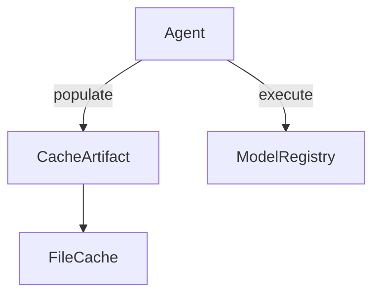

## Context Specification

### Description
An agent is a context used to execute an agent. It has an embedded templating engine capable of handling placeholders within its specifications. The `agent` role includes operations such as populating and executing the agent, while managing caching mechanisms.

### Roles

- **Agent**: 
  - **populate**: Runs the templating engine using the agent registry with input values. Returns the instantiated agent specification or fails if a mandatory placeholder is not replaced.
  - **execute**: Uses the agent model registry to find the appropriate model and instantiates it via the populated specifications from `populate`. If the agent supports conversation style, treats conversations as part of the template.
  - **get_cached_artifact**: Utilizes the file cache to generate a hash for the folder structure based on instructions and model name. Returns an object implementing the cache trait.

- **Cache**:
  - No role player plays this role.

### Props

- **input**: A genericly typed argument.
- **agent registry**: A registry used to load an agent specification from its name.
- **agent model registry**: A registry that loads models based on the agent's execution requirements.
- **cache prop**: A storage mechanism for caching results, ensuring persistent caching and separate cache folders per instruction and model.

### Functionality

- **run**: Activates the agent by calling `execute` and awaiting its result. Ensures cache persistence and uses a file cache to store results based on a unique hash derived from `agent instructions + model name`. The input JSON also contributes to this hash, creating separate entries within the same instruction/model folder.

### Inferred Types or Structures (Non-Blocking)

**Inferred Types:**
1. **Agent**: 
   - Contains fields for `populate`, `execute`, and `get_cached_artifact`.
2. **Cache Trait**: 
   - Contains methods that implement caching behavior, possibly including `set`, `get`, `exists`, etc.

### Blocking Ambiguities

- None identified based on the provided context and dependencies.

### Implementation Choices Left Open

1. **Exact collection/sequence type** for managing cache entries.
2. **Signature mechanics** (parameter names, ownership/borrowing) in method signatures without affecting behavior.
3. **Concrete crate/library choice** for implementing caching.
4. **Formatting mechanics** (`Display`/`Debug`) when output behavior is still satisfied.

## Direct Dependency Context

### FileCache

- **Description**: An implementation of the cache trait that keeps cache artifacts in a file structure, using keys to derive filenames and folder structures.
- **Props**:
  - **folder**: An optional path to the root folder of the cache. Defaults to `.reen`.
  - **instructions_model_hash**: A hash derived from `agent_instructions + model_name` used as a subfolder.

- **Functionality**: Implements the Cache trait, ensuring separate cache folders for different instruction/model combinations and input values.

## Diagrams & Notation

### Context Diagram

This diagram illustrates the flow of operations, with `Agent` interacting with both `CacheArtifact` and `ModelRegistry`.

## Validation Checklist

- [X] Every behavior is traceable to the draft text.
- [X] No new roles, rules, or flows were added.
- [X] Names exactly match the draft.
- [X] Referenced items in dependency context were resolved before adding any **Blocking Ambiguities** entry.
- [X] All inferences are explicitly documented as inferred.
- [X] Blocking ambiguities are truly behavior-impacting or contradictory.
- [X] Non-blocking technical details are captured under **Implementation Choices Left Open**.